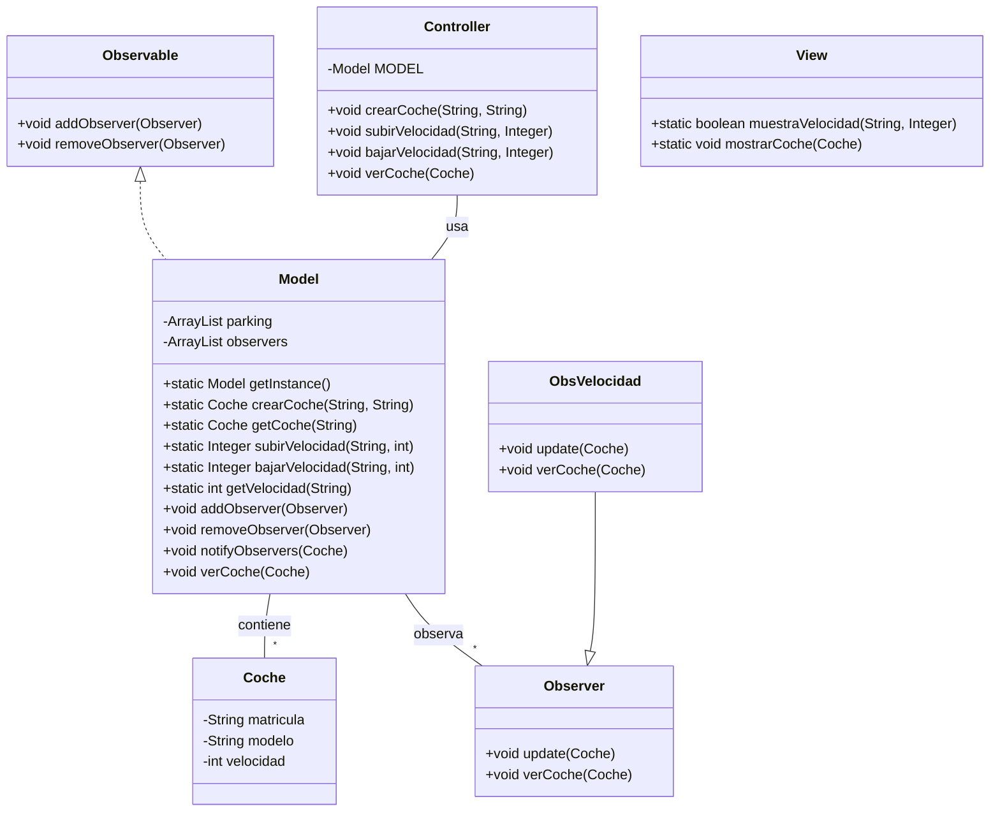
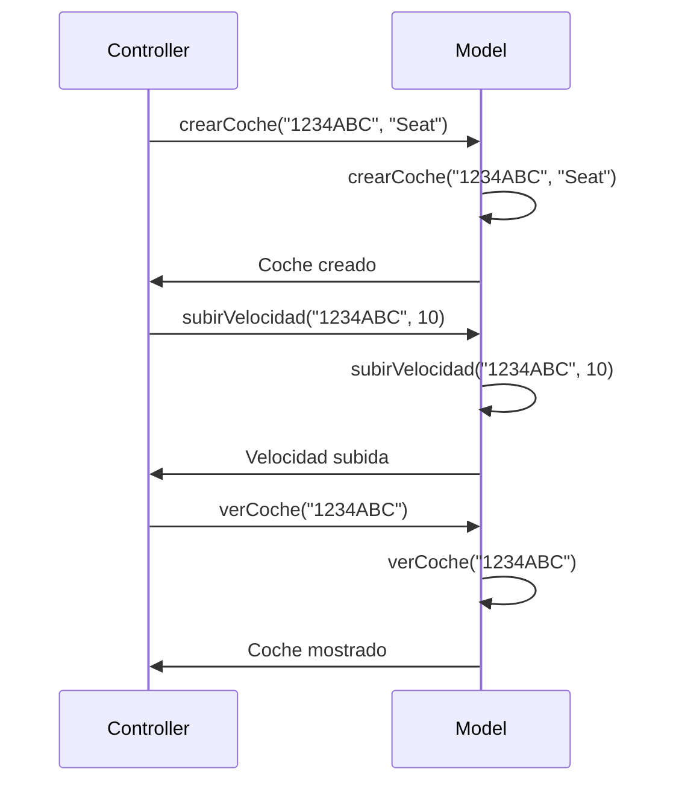

# Tarea: arquitectura MVC

Tarea para implementar arquitectura MVC

Utiliza objetos coches, modifica la velocidad y la muestra

---

## Clases ```Controller``` y ```Model```

- Implementa la clase ```Controller``` y ```Model``` según el diagrama de clases.

- Implementa los métodos ```crearCoche()```, ```getCoche()```, ```cambiarVelocidad()``` y ```getVelocidad()```

- Realiza los test necesarios para comprobar que funcionan correctamente

### Diagrama de clases:



---

### Diagrama de Secuencia

Ejemplo básico del procedimiento, sin utilizar los nombres de los métodos


